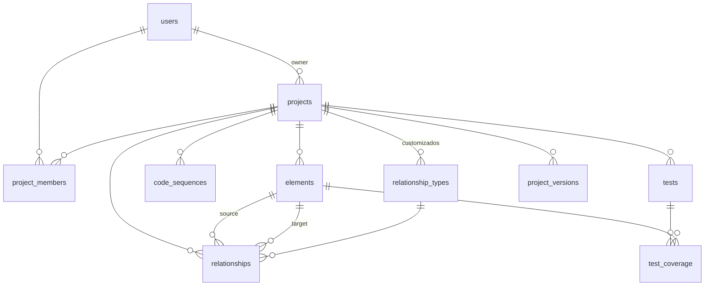

# Schema do banco de dados, V&V Monitor

Banco: PostgreSQL 16. Migrações versionadas com Flyway: `V1__schema_inicial` (tabelas) e `V2__ultima_submissao` (ultima submissao em `projects`).

## Convenções

- Chaves primárias UUID (não expõem volume de registros nem permitem enumeração, RNF4).
- Datas em `timestamptz`.
- Códigos legíveis (RF3, RNF1, RN2, T1) em coluna própria, separados da PK.
- **Soft delete**: tabelas com timestamps têm `deleted_at timestamptz NULL`. Registro com `deleted_at` preenchido é tratado como removido.
  - Restrições de unicidade são **índices únicos parciais** (`WHERE deleted_at IS NULL`), para que registros removidos não bloqueiem novos.
  - No Hibernate: `@SQLDelete` (converte DELETE em UPDATE de `deleted_at`) e `@SQLRestriction("deleted_at IS NULL")` em cada entidade.
  - Remoção em cascata feita pela aplicação, na mesma transação (RF15: remover requisito "e suas associações"; remover projeto remove seu conteúdo).
- Exceções ao soft delete: `project_versions` (imutável, RNF2) e `code_sequences` (contador interno).

## Enums

| Enum | Valores |
|---|---|
| member_role | `OWNER`, `EDITOR`, `VIEWER` |
| element_kind | `FUNCTIONAL`, `NON_FUNCTIONAL`, `BUSINESS_RULE` |
| sequence_kind | `FUNCTIONAL`, `NON_FUNCTIONAL`, `BUSINESS_RULE`, `TEST` |
| priority | `MANDATORY`, `DESIRABLE`, `OPTIONAL` |
| submission_status | `DRAFT`, `SUBMITTED` |
| test_status | `NOT_RUN`, `PASSED`, `FAILED` |

## Tabelas

### users (RF1, RF2, RNF3)

| Coluna | Tipo | Restrições |
|---|---|---|
| id | uuid | PK |
| name | varchar(120) | NOT NULL |
| email | varchar(255) | NOT NULL, armazenado em minúsculas |
| password_hash | varchar(72) | NOT NULL, hash BCrypt |
| created_at | timestamptz | NOT NULL |
| updated_at | timestamptz | NOT NULL |
| deleted_at | timestamptz | NULL |

Índices: único parcial `(email) WHERE deleted_at IS NULL`.

### projects (RF3, RF4)

| Coluna | Tipo | Restrições |
|---|---|---|
| id | uuid | PK |
| name | varchar(150) | NOT NULL |
| description | text | NULL |
| owner_id | uuid | NOT NULL, FK → users |
| last_submitted_at | timestamptz | NULL; ultima submissao do modelo (RF10, migracao V2) |
| last_submitted_by | uuid | NULL, FK → users; quem submeteu (os dois campos andam juntos: CHECK `ck_projects_last_submission`) |
| created_at | timestamptz | NOT NULL |
| updated_at | timestamptz | NOT NULL |
| deleted_at | timestamptz | NULL |

### project_members (RF20, RNF4)

| Coluna | Tipo | Restrições |
|---|---|---|
| id | uuid | PK |
| project_id | uuid | NOT NULL, FK → projects |
| user_id | uuid | NOT NULL, FK → users |
| role | member_role | NOT NULL |
| added_at | timestamptz | NOT NULL |
| deleted_at | timestamptz | NULL |

Índices: único parcial `(project_id, user_id) WHERE deleted_at IS NULL`.
O criador do projeto entra como `OWNER`. Compartilhamento só com usuários já cadastrados (convites para e-mails não cadastrados ficam para depois).

### elements (RF5, RF6, RF10)

Requisitos funcionais, não funcionais e regras de negócio numa tabela única, para que relacionamentos (RF7) apontem sempre para a mesma tabela.

| Coluna | Tipo | Restrições |
|---|---|---|
| id | uuid | PK |
| project_id | uuid | NOT NULL, FK → projects |
| kind | element_kind | NOT NULL |
| code | varchar(20) | NOT NULL (ex.: RF3, RNF1, RN2) |
| description | text | NOT NULL |
| priority | priority | NULL; obrigatório para requisitos, nulo para regras de negócio (CHECK) |
| submission_status | submission_status | NOT NULL, default `DRAFT` |
| created_by | uuid | NOT NULL, FK → users |
| created_at | timestamptz | NOT NULL |
| updated_at | timestamptz | NOT NULL |
| deleted_at | timestamptz | NULL |

Índices: único parcial `(project_id, code) WHERE deleted_at IS NULL`.
CHECK: `(kind = 'BUSINESS_RULE') = (priority IS NULL)`.
A visualização (RF11) mostra apenas `SUBMITTED` (UC-07).

### code_sequences (identificador dinâmico)

| Coluna | Tipo | Restrições |
|---|---|---|
| project_id | uuid | PK composta, FK → projects |
| kind | sequence_kind | PK composta |
| next_value | int | NOT NULL, default 1 |

Incrementado com `SELECT ... FOR UPDATE` na mesma transação do cadastro. Códigos nunca são reutilizados, mesmo após remoção.

### relationship_types (RF8)

| Coluna | Tipo | Restrições |
|---|---|---|
| id | uuid | PK |
| project_id | uuid | NULL, FK → projects (nulo = tipo pré-definido global) |
| name | varchar(60) | NOT NULL |
| is_symmetric | boolean | NOT NULL |
| created_at | timestamptz | NOT NULL |
| deleted_at | timestamptz | NULL |

Índices: único parcial `(project_id, name) WHERE deleted_at IS NULL` e único parcial `(name) WHERE project_id IS NULL AND deleted_at IS NULL`.
Seed na migração inicial: Dependência (direcional), Conflito (simétrico), Refinamento (direcional), Similaridade (simétrico).

### relationships (RF7, UC-06, RF10)

| Coluna | Tipo | Restrições |
|---|---|---|
| id | uuid | PK |
| project_id | uuid | NOT NULL, FK → projects |
| source_id | uuid | NOT NULL, FK → elements |
| target_id | uuid | NOT NULL, FK → elements |
| type_id | uuid | NOT NULL, FK → relationship_types |
| submission_status | submission_status | NOT NULL, default `DRAFT` |
| created_by | uuid | NOT NULL, FK → users |
| created_at | timestamptz | NOT NULL |
| deleted_at | timestamptz | NULL |

CHECK: `source_id <> target_id`.
Índices: único parcial `(source_id, target_id, type_id) WHERE deleted_at IS NULL` (exceção de duplicidade do UC-06).
Para tipos simétricos, a aplicação grava o par em ordem fixa (menor UUID como source), evitando A–B e B–A duplicados.

### tests (RF9)

| Coluna | Tipo | Restrições |
|---|---|---|
| id | uuid | PK |
| project_id | uuid | NOT NULL, FK → projects |
| code | varchar(20) | NOT NULL (ex.: T1) |
| description | text | NOT NULL |
| status | test_status | NOT NULL, default `NOT_RUN` |
| created_by | uuid | NOT NULL, FK → users |
| created_at | timestamptz | NOT NULL |
| updated_at | timestamptz | NOT NULL |
| deleted_at | timestamptz | NULL |

Índices: único parcial `(project_id, code) WHERE deleted_at IS NULL`.

### test_coverage (RF9, RF13)

| Coluna | Tipo | Restrições |
|---|---|---|
| id | uuid | PK |
| test_id | uuid | NOT NULL, FK → tests |
| element_id | uuid | NOT NULL, FK → elements (somente FUNCTIONAL ou NON_FUNCTIONAL, validado na aplicação) |
| created_at | timestamptz | NOT NULL |
| deleted_at | timestamptz | NULL |

Índices: único parcial `(test_id, element_id) WHERE deleted_at IS NULL`.

### project_versions (RF17, RF18, RNF2)

| Coluna | Tipo | Restrições |
|---|---|---|
| id | uuid | PK |
| project_id | uuid | NOT NULL, FK → projects |
| version_number | int | NOT NULL |
| label | varchar(100) | NULL |
| snapshot | jsonb | NOT NULL (elementos, relacionamentos, testes e coberturas) |
| created_by | uuid | NOT NULL, FK → users |
| created_at | timestamptz | NOT NULL |

Índices: único `(project_id, version_number)`.
Imutável: sem `deleted_at`; trigger bloqueia UPDATE e DELETE.

## Fora do escopo inicial (migrações futuras)

- `integrations` e `external_links` (RF19).
- `project_invitations` (convite por e-mail não cadastrado, RF20).
- `change_log` (histórico granular de alterações).

## Diagrama

